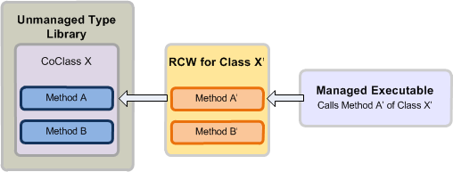

# Einführung in die Interoperabilität zwischen COM und .NET

Das Component Object Model (COM) und die .NET-Entwicklung verfügen über erhebliche Unterschiede in Bezug auf Typsysteme und Mechanismen für die Lebensdauerverwaltung für Objekte, die Schnittstellenerstellung und die Schnittstellenvererbung. 

Ein **Variant**-Typ in COM ist beispielsweise ein **System.Object**-Datentyp in .NET Framework. Um ein Objekt zu erstellen, ruft ein COM-Client [CoCreateInstance](https://docs.microsoft.com/windows/desktop/api/combaseapi/nf-combaseapi-cocreateinstance) auf, während ein verwalteter Client Schlüsselwörter wie „new“ oder „New“ verwendet, die in eine verwaltete Programmiersprache integriert sind. 

Während COM die klassische Vererbung nicht unterstützt, und ein COM-Client einen internen Referenzzähler von [IUnknown](https://docs.microsoft.com/windows/desktop/api/unknwn/nn-unknwn-iunknown) verwendet, um eine Co-Klasse freizugeben, beruht ein verwalteter Client auf der zur Laufzeit durchgeführten Garbage Collection von .NET Framework, um ein Objekt freizugeben. 

Diese Unterschiede zwischen der COM- und .NET-Entwicklung müssen durch einen Mechanismus aufgelöst werden, wenn Sie einen verwalteten Client auf einem COM-Objektmodell entwickeln. Der Runtime Callable Wrapper (RCW) ist ein solcher Mechanismus, der eine transparente Kommunikation zwischen COM und dem verwalteten Programmierungsmodell ermöglicht.

In diesem Artikel finden Sie eine allgemeine Beschreibung dazu, wie mit RCW die Kommunikation zwischen COM und dem verwaltete Programmiermodell vereinfacht wird. Obwohl in diesem Thema Visual Studio verwendet wird, um den RCW-Mechanismus zu veranschaulichen, können Sie auch eine Interopassembly außerhalb von Visual Studio zum Entwickeln eines verwalteten Clients verwenden.

## Gewährleisten von Interoperabilität: die Interopassembly und RCW

### Kompilierzeit

Eine Interopassembly definiert verwaltete Schnittstellen, die einer COM-basierten Typbibliothek zugeordnet sind und mit denen ein verwalteter Client kommunizieren kann. Um eine Interopassembly in Visual Studio zu verwenden, müssen Sie zunächst einen Verweis auf die entsprechende COM-Komponente hinzufügen. Visual Studio generiert automatisch eine lokale Kopie der Interopassembly. Die Interopassembly enthält einen Namespace, unter dem eine entsprechende verwaltete Schnittstelle der einzelnen COM-Objekte im COM-Objektmodell vorliegt. 

Abbildung 1 zeigt einen verwalteten Client, der eine COM-Typbibliothek verwenden möchte, die die Co-Klasse X definiert. Der verwaltete Client ruft die Klasse X auf, die der entsprechenden verwalteten Schnittstelle für die Co-Klasse X entspricht, die in der Interopassembly definiert ist. Zum Zeitpunkt der Kompilierung wird das verwaltete Projekt mit Informationen über die Klasse X von der Interopassembly kompiliert.

**Abbildung 1: Eine verwaltete Anwendung, kompiliert mit einer Interopassembly, die mit einer nicht verwalteten Typbibliothek zusammenarbeitet**

  
Solange Sie eine Referenz zu einer Typbibliothek festlegen, generiert Visual Studio eine Kopie der Interopassembly für diese Typbibliothek. Es kann eine große Anzahl an Interopassemblys für einen COM-Typ geben. Dagegen gibt es nur eine primäre Interopassembly (PIA) für eine Typbibliothek; und zwar genau die Interopassembly, die von der Typbibliothek herausgegeben wird. Im Unterschied zu anderen Interopassemblys wir die PIA nicht jedes mal neu generiert, wenn eine Referenz in Visual Studio hinzugefügt wird. Stattdessen installieren Sie die PIA in den globalen Assemblycache (GAC) nur einmal pro Computer. Wenn Sie eine Referenz zur Typbibliothek hinzufügen, lädt Visual Studio die PIA automatisch.

Um eine verwaltete Lösung für Outlook zu programmieren, sollten Sie die Outlook-PIA verwenden. Um Informationen aus der Outlook-PIA in ein verwaltetes Add-In einzubinden, installieren Sie zuerst die Outlook-PIA im GAC. Wenn Sie Visual Studio zum Erstellen eines verwalteten Projekts verwenden, lädt Visual Studio die PIA, nachdem Sie eine Referenz zur Outlook-Typbibliothek hinzugefügt haben. Im Objektbrowser unter dem Namespace Microsoft.Office.Interop.Outlook finden Sie verwaltete Schnittstellen mit Namen, die den Objekten im Outlook-Objektmodell entsprechen. Beispielsweise entspricht die Account-Schnittstelle dem **Account**-Objekt im Outlook-Objektmodell. Beim Kompilieren des verwalteten Projekts werden diese Informationen in die ausführbare Datei integriert.

### Laufzeit

Zur Laufzeit erstellt die CRL von .NET Framework mit den Informationen der Interopassembly einen RCW für jede Co-Klasse, mit der der verwaltete Client interagiert. Beachten Sie, dass nur ein RCW für jede Co-Klasse erstellt wird, unabhängig davon, wie viele Schnittstellen der Client aus der Co-Klasse abgerufen hat. Der RCW ist ein .NET-Klassentyp, der um die COM-Co-Klasse angeordnet wird. Der RCW verfolgt die Co-Klasseninstanzen und ordnet ihnen Referenzen zu, wenn der Client den RCW nicht mehr benötigt. Daher muss ein .NET-Client die Lebensdauer eines Objekts nicht in der Weise verwalten, wie es ein unverwalteter Client unter COM tun müsste.

Abbildung 2 zeigt einen RCW, der einen API-Aufruf eines verwalteten Clients zur Laufzeit unterbricht und mithilfe der Informationen der Interopassembly den Aufruf der entsprechenden API in der COM-Co-Klasse zuordnet. Das folgende Verfahren beschreibt, wie das geschieht:

1.  Der verwaltete Client ruft Methode A' von Klasse X' auf, wie in der Interopassembly für eine COM-Typbibliothek definiert wurde.

2.  Falls noch kein RCW für Klasse X' vorhanden ist, verwendet die .NET Framework-Laufzeit Informationen der Interopassembly und erstellt einen RCW für Klasse X'.

3.  Der RCW unterbricht den Aufruf von Methode A', übersetzt die Argumente in entsprechende COM-Typen und ruft Methode A der Co-Klasse X auf wie in der COM-Typbibliothek definiert.

**Abbildung 2. RCW unterbricht Aufruf von einer verwalteten ausführbaren Datei und ordnet ihn einer Co-Klasse einer nicht verwalteten Typbibliothek zu**

  

## Siehe auch

- [Gründe für die Verwendung der Outlook-PIA](why-use-the-outlook-pia.md)
- [Installieren der Outlook-PIA und Verweisen auf diese](installing-and-referencing-the-outlook-pia.md)

